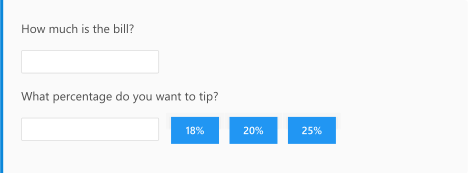

alia - A Library for Interactive Applications
=============================================

[](https://github.com/alialib/alia/actions)
[](https://github.com/alialib/alia/actions)
[](https://github.com/alialib/alia/actions)
[](https://github.com/alialib/alia/actions/workflows/docs-staging.yml)
[](https://github.com/alialib/alia/actions/workflows/html-staging.yml)
[](https://codecov.io/gh/alialib/alia)

[](https://github.com/orangemug/stability-badges#unstable)

alia (pronounced uh-LEE-uh) is a modern C++ library for declaratively
developing user interfaces.

alia currently targets the web. It leverages
[Emscripten](https://emscripten.org/) and
[asm-dom](https://github.com/mbasso/asm-dom) to allow you to write client-side
web apps in C++. The declarative core of alia, however, is independent of all
this, and the intention is to eventually target other environments, including
native desktop applications. Stay tuned...

For more info on alia, see [its website](https://alia.dev/).

Obligatory pretty picture and code... (Click the image for the
interactive version!)

[](https://alia.dev/#/?id=live-example)

```cpp
void
tip_calculator(html::context ctx)
{
    // Get some component-local state for the bill amount.
    auto bill = get_state(ctx, empty<double>());
    p(ctx, "How much is the bill?");
    // Display an input that allows the user to manipulate our bill state.
    input(ctx, bill);

    // Get some more component-local state for the tip rate.
    auto tip_rate = get_state(ctx, empty<double>());
    p(ctx, "What percentage do you want to tip?");
    // Users like percentages, but we want to keep the 'tip_rate' state as a
    // rate internally, so this input presents a scaled view of it for the user.
    input(ctx, scale(tip_rate, 100));
    // Add a few buttons that set the tip rate to common values.
    button(ctx, "18%", tip_rate <<= 0.18);
    button(ctx, "20%", tip_rate <<= 0.20);
    button(ctx, "25%", tip_rate <<= 0.25);

    // Calculate the results and display them for the user.
    // Note that these operations have dataflow semantics, and since `bill` and
    // `tip_rate` both start out empty, nothing will actually be calculated
    // (or displayed) until the user supplies values for them.
    auto tip = bill * tip_rate;
    auto total = bill + tip;
    p(ctx,
        printf(ctx,
            "You should tip %.2f, for a total of %.2f.", tip, total));

    // Conditionally display a message suggesting cash for small amounts.
    alia_if (total < 10)
    {
        p(ctx,
            "You should consider using cash for small amounts like this.");
    }
    alia_end
}
```
